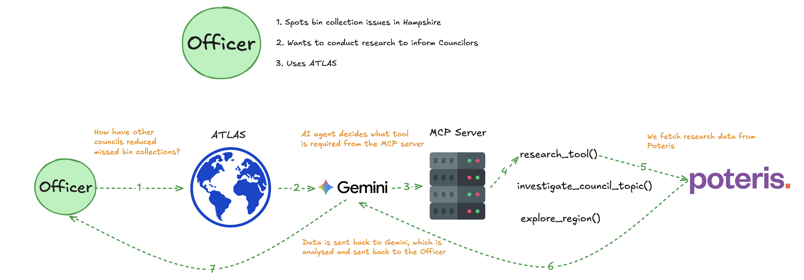

# Atlas

Atlas is an evidence-first research assistant for UK council officers. Officers can investigate service issues, compare councils, explore regions, and ask follow-up questions. Atlas retrieves council records through the [Poteris Council Gateway](https://councilgateway.poteris.co.uk/council-api/docs) and uses Gemini to turn the evidence into a cited briefing.

## Workflow



Map selections deterministically run `explore_region`; typed questions allow the agent to choose the appropriate MCP tools. Follow-ups include conversation context and previously verified evidence.

## Run locally

```bash
pnpm install
cp .env.example apps/web/.env.local
pnpm dev
```

Add your `GEMINI_API_KEY` to `apps/web/.env.local`, then open [http://localhost:3000](http://localhost:3000).

```bash
pnpm typecheck
pnpm build
```

Built with TypeScript, Next.js, pnpm, Gemini, MCP, Atlassian design tokens, and the Poteris Council Gateway.
